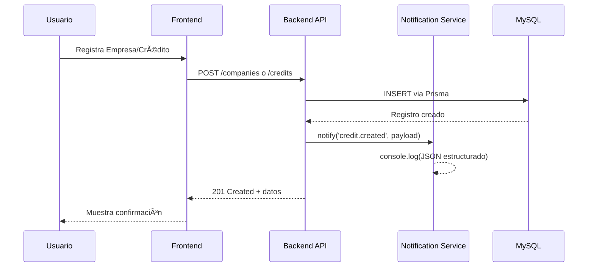

# CreditCloud - Sistema de Gestión de Créditos Corporativos

Sistema de gestión de Líneas de Crédito para Empresas que permite registrar clientes corporativos, gestionar solicitudes de financiamiento y automatizar notificaciones de estado.

## 📋 Tabla de Contenidos

- [Arquitectura](#arquitectura)
- [Tecnologías](#tecnologías)
- [Requisitos Previos](#requisitos-previos)
- [Instalación y Setup](#instalación-y-setup)
- [Endpoints de la API](#endpoints-de-la-api)
- [Estructura del Proyecto](#estructura-del-proyecto)
- [Despliegue en Google Cloud Platform](#despliegue-en-google-cloud-platform)
- [Análisis de Costo-Eficiencia](#análisis-de-costo-eficiencia)

---

## Arquitectura


### Flujo de Datos



---

## Tecnologías

| Capa | Tecnología | Versión |
|------|------------|---------|
| **Frontend** | Angular | 19.x |
| **Estilos** | CSS Custom + Tailwind | 4.x |
| **Backend** | Node.js + Express | 22.x / 5.x |
| **ORM** | Prisma | 6.x |
| **Base de Datos** | MySQL | 8.x |
| **Contenedores** | Docker + Docker Compose | - |
| **Cloud Platform** | Google Cloud Platform | - |
| **Servicios GCP** | Cloud Run, Cloud SQL, Artifact Registry | - |

---

## Requisitos Previos

- **Node.js** v20+ 
- **Docker** y **Docker Compose**
- **npm** o **yarn**

---

## Instalación y Setup

### Opción A: Docker Compose (Recomendado)

```bash
# Clonar repositorio
git clone <repo-url>
cd credit-multicloud-challenge

# Levantar todos los servicios
docker-compose up --build -d

# Ver logs
docker-compose logs -f
```

Servicios disponibles:
- **Frontend:** http://localhost (puerto 80)
- **Backend API:** http://localhost:3000
- **MySQL:** localhost:3306

```bash
# Detener servicios
docker-compose down

# Detener y eliminar volúmenes (reset DB)
docker-compose down -v
```

---

### Opción B: Desarrollo Local

### 1. Clonar el repositorio

```bash
git clone <repo-url>
cd credit-multicloud-challenge
```

### 2. Iniciar la base de datos

```bash
docker-compose up db -d
```

Esto levanta MySQL en `localhost:3306` con:
- Usuario: `root`
- Contraseña: `root`
- Base de datos: `creditdb`

### 3. Configurar el Backend

```bash
cd backend

# Instalar dependencias
npm install

# Configurar variables de entorno
cp .env.example .env
# Editar .env si es necesario

# Ejecutar migraciones de Prisma
npx prisma migrate dev

# Iniciar servidor de desarrollo
npm run dev
```

El backend estará disponible en `http://localhost:3000`

### 4. Configurar el Frontend

```bash
cd frontend

# Instalar dependencias
npm install

# Iniciar servidor de desarrollo
npm start
```

El frontend estará disponible en `http://localhost:4200`

### 5. Verificar instalación

```bash
# Health check del backend
curl http://localhost:3000/health
# Respuesta: {"ok":true}

# Abrir frontend en navegador
# Docker: http://localhost
# Local:  http://localhost:4200
```

---

## Endpoints de la API

### Empresas

| Método | Endpoint | Descripción |
|--------|----------|-------------|
| `POST` | `/companies` | Registrar nueva empresa |
| `GET` | `/companies` | Listar todas las empresas |
| `GET` | `/companies/:id/credits` | Historial de créditos de una empresa |

#### Crear Empresa
```bash
curl -X POST http://localhost:3000/companies \
  -H "Content-Type: application/json" \
  -d '{
    "name": "Acme Corp",
    "taxId": "900123456",
    "sector": "Technology",
    "annualIncome": 1000000
  }'
```

### Créditos

| Método | Endpoint | Descripción |
|--------|----------|-------------|
| `POST` | `/credits` | Solicitar nuevo crédito |
| `GET` | `/credits` | Listar todos los créditos |
| `PUT` | `/credits/:id/status` | Actualizar estado del crédito |

#### Solicitar Crédito
```bash
curl -X POST http://localhost:3000/credits \
  -H "Content-Type: application/json" \
  -d '{
    "companyId": "<UUID>",
    "amount": 50000,
    "termMonths": 12
  }'
```

#### Aprobar Crédito
```bash
curl -X PUT http://localhost:3000/credits/<UUID>/status \
  -H "Content-Type: application/json" \
  -d '{"status": "APPROVED"}'
```

---

## Estructura del Proyecto

```
credit-multicloud-challenge/
├── backend/
│   ├── prisma/
│   │   └── schema.prisma       # Esquema de BD
│   ├── src/
│   │   ├── config/
│   │   │   └── prisma.js       # Cliente Prisma
│   │   ├── controllers/
│   │   │   ├── company.controller.js
│   │   │   └── credit.controller.js
│   │   ├── routes/
│   │   │   ├── company.routes.js
│   │   │   └── credit.routes.js
│   │   ├── services/
│   │   │   └── notification.service.js
│   │   └── server.js           # Entry point
│   └── package.json
├── frontend/
│   ├── src/
│   │   ├── app/
│   │   │   ├── core/           # Servicios y modelos
│   │   │   ├── pages/          # Componentes de página
│   │   │   └── shared/         # Componentes compartidos
│   │   ├── styles.css          # Estilos globales
│   │   └── index.html
│   └── package.json
├── docker-compose.yml          # MySQL containerizado
├── .gitignore
└── README.md
```

---

## Despliegue en Google Cloud Platform

### Arquitectura en GCP

El sistema está desplegado en **Google Cloud Platform** utilizando los siguientes servicios:

| Servicio | Uso | Costo Estimado |
|----------|-----|-----------------|
| **Cloud Run** | Backend y Frontend (serverless) | ~$0-10/mes (pago por uso) |
| **Cloud SQL** | Base de datos MySQL 8 | ~$25-50/mes (instancia pequeña) |
| **Artifact Registry** | Almacenamiento de imágenes Docker | ~$0.10/GB/mes |
| **Cloud Build** | CI/CD para builds | ~$0.003/minuto de build |

### Servicios Desplegados

- **Backend API**: `creditcloud-backend` en Cloud Run
  - URL: `https://creditcloud-backend-766205909248.us-central1.run.app`
  - Escalado automático (0 a N instancias)
  - Conectado a Cloud SQL mediante IP pública

- **Frontend**: `creditcloud-frontend` en Cloud Run
  - URL: `https://creditcloud-frontend-766205909248.us-central1.run.app`
  - Proxy nginx para rutas API al backend

- **Base de Datos**: `creditcloud-mysql` en Cloud SQL
  - Región: `us-central1`
  - Versión: MySQL 8.0
  - Configuración: 1 CPU, 4GB RAM, 10GB SSD

- **Migraciones**: Cloud Run Job `creditcloud-migrate`
  - Ejecuta `npx prisma migrate deploy` automáticamente

### Variables de Entorno en GCP

```bash
# Backend en Cloud Run
DATABASE_URL="mysql://user:pass@<cloud-sql-ip>:3306/creditdb"
PORT=3000
NODE_ENV=production
```

### Instrucciones de Despliegue en GCP

#### 1. Crear instancia Cloud SQL

```bash
gcloud sql instances create creditcloud-mysql \
  --database-version=MYSQL_8_0 \
  --cpu=1 --memory=4GB \
  --region=us-central1
```

#### 2. Crear base de datos y usuario

```bash
gcloud sql databases create creditdb --instance=creditcloud-mysql
gcloud sql users create credituser --instance=creditcloud-mysql --password=<password>
```

#### 3. Construir y subir imágenes Docker

```bash
# Backend
cd backend
gcloud builds submit . --tag us-central1-docker.pkg.dev/<project-id>/creditcloud/backend:1.0.0

# Frontend
cd frontend
gcloud builds submit . --tag us-central1-docker.pkg.dev/<project-id>/creditcloud/frontend:1.0.0
```

#### 4. Desplegar en Cloud Run

```bash
# Backend
gcloud run deploy creditcloud-backend \
  --image us-central1-docker.pkg.dev/<project-id>/creditcloud/backend:1.0.0 \
  --region us-central1 \
  --set-env-vars DATABASE_URL="mysql://user:pass@<cloud-sql-ip>:3306/creditdb" \
  --allow-unauthenticated

# Frontend
gcloud run deploy creditcloud-frontend \
  --image us-central1-docker.pkg.dev/<project-id>/creditcloud/frontend:1.0.0 \
  --region us-central1 \
  --port 80 \
  --allow-unauthenticated
```

#### 5. Ejecutar migraciones

```bash
gcloud run jobs create creditcloud-migrate \
  --image us-central1-docker.pkg.dev/<project-id>/creditcloud/backend:1.0.0 \
  --region us-central1 \
  --set-cloudsql-instances <project-id>:us-central1:creditcloud-mysql \
  --set-env-vars DATABASE_URL="mysql://user:pass@<cloud-sql-ip>:3306/creditdb" \
  --command npx --args prisma,migrate,deploy

gcloud run jobs execute creditcloud-migrate --region us-central1 --wait
```

### Resumen de Costos Estimados

| Ambiente | Costo Mensual |
|----------|---------------|
| **Desarrollo (Local)** | $0 |
| **Producción (GCP)** | ~$30-60/mes |

**Desglose:**
- Cloud Run: ~$0-10/mes (pago por uso, muy bajo tráfico)
- Cloud SQL: ~$25-50/mes (instancia db-f1-micro o db-n1-standard-1)
- Artifact Registry: ~$0.50/mes (pocas imágenes)
- Cloud Build: ~$1-5/mes (builds ocasionales)

### Análisis de Costo-Eficiencia

#### 1. Base de Datos: Cloud SQL (GCP)

**Elección:** Cloud SQL MySQL 8.0
- **Razón:** Escalabilidad automática, backups incluidos, alta disponibilidad
- Backups automáticos sin costo adicional
- Conexión segura desde Cloud Run
- Escalado vertical fácil cuando sea necesario

#### 2. Backend y Frontend: Cloud Run

**Elección:** Cloud Run (serverless)
- **Razón:** Pago solo por uso, escalado automático a cero
- Sin servidores que mantener
- Despliegue simple con `gcloud run deploy`
- Integración nativa con otros servicios GCP

#### 3. Sistema de Notificaciones

**Implementación actual:** Logs Estructurados (JSON)
- Costo: $0 (incluido en Cloud Logging)
- Compatible con Cloud Logging para análisis
- **Extensible a:** Pub/Sub cuando sea necesario (~$0.04/millón mensajes)

#### 4. Imágenes Docker: Artifact Registry

**Elección:** Artifact Registry
- Integración nativa con Cloud Run
- Versionado automático de imágenes
- Costo muy bajo para proyectos pequeños

---

## Scripts Disponibles

### Docker
```bash
docker-compose up --build -d   # Levantar todo
docker-compose down            # Detener
docker-compose logs -f         # Ver logs
docker-compose down -v         # Reset completo
```

### Backend
```bash
npm run dev    # Desarrollo con hot-reload
npm start      # Producción
```

### Frontend
```bash
npm start      # Desarrollo (puerto 4200)
npm run build  # Build de producción
```

---
